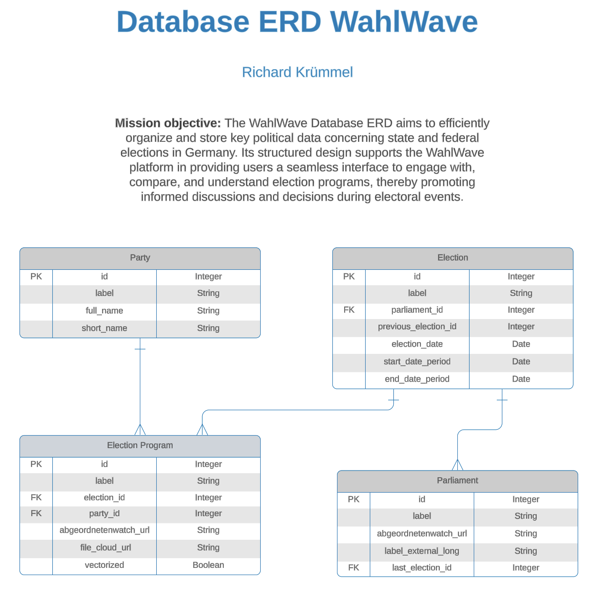
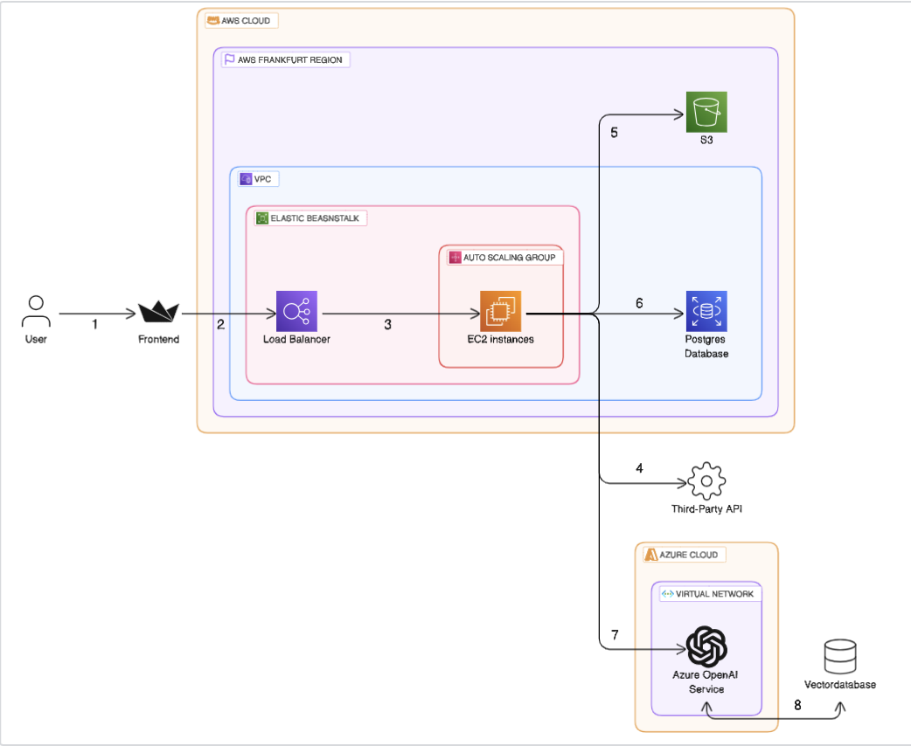
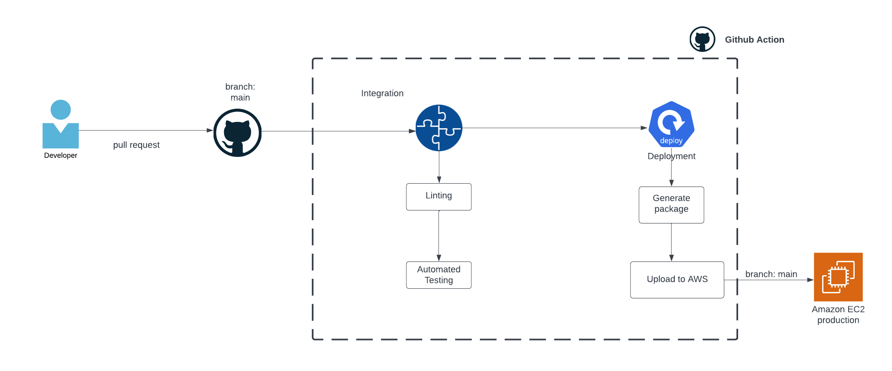

# Wahlwave - Backend

Welcome to the Wahlwave (formerly Chat-Your-Gesetzentwurf) Backend repository. Wahlwave is designed for the interactive exploration of German election programs. The backend is a crucial piece in the Wahlwave application, working behind the scenes to process queries, manage data, and integrate various technologies.

Core Features

- Query Processing: The backend is key in handling user inputs from the [Wahlwave Frontend](https://github.com/RichardKruemmel/wahlwave-frontend), ensuring efficient processing and response generation.
- Data Management and Storage: Utilizing PostgreSQL for database management and AWS S3 for file storage, the backend handles large volumes of election program PDFs and their associated data while keeping the data up-to-date using [Scrapy](https://docs.scrapy.org/en/latest/index.html).
- Vector Database with Qdrant: For managing and querying vector data, [Qdrant](https://qdrant.tech/) is employed, enhancing the efficiency of data retrieval.
- Local ChatGPT Models on Azure: The backend integrates with Azure-hosted OpenAI services for running local ChatGPT models, contributing to the robust and GDPR-compliant AI capabilities of the Wahlwave platform.
- Monitoring and Evaluation Tools: Tools like [Langfuse](https://langfuse.com/) for monitoring and [Ragas](https://docs.ragas.io/en/latest/index.html) for response evaluation are integral to maintaining the quality and reliability of the platform's outputs.

The Wahlwave Backend, with its use of different technologies and data management strategies, is essential for delivering a seamless and interactive user experience on the Wahlwave platform. It's where the technical intricacies meet user-focused functionalities, creating a reliable and efficient system for political content exploration.

## Prerequisites

- Install Python 3.11 or higher
- Install [poetry](https://python-poetry.org/docs/#installing-with-the-official-installer)

## Running Locally

### Clone the Project

Clone the project repository from GitHub:

```bash
git clone https://github.com/RichardKruemmel/chat-your-gesetzentwurf.git
```

### Set Environment Variables

A `.sample.env` file is included in the project repository as a template for your own `.env` file. Copy the `.sample.env` file and rename the copy to `.env`:

```bash
cp .sample.env .env
```

Edit the .env file to set your own environment variables.

### Running the Backend Independently (Optional)

_Note_: Running the backend by itself won't establish a connection with the database. Make sure to run the database service separately or together with the backend for full functionality.

We are using [poetry]https://python-poetry.org/) for dependency management and [uvicorn](https://www.uvicorn.org/) for server implementation. Follow these commands:

Every time you run the backend

```bash
  # Create a virtual environment
  $ poetry shell
  # Install all packages
  $ poetry install
  # Start API server on port 8000
  $ poetry run uvicorn app.main:app --reload
```

### Docker (coming soon)

Ensure you have Docker Desktop installed on your machine. [Docker Desktop](https://www.docker.com/products/docker-desktop)) is a comprehensive solution for running Docker on Windows and MacOS systems. It includes Docker Compose, which is required to orchestrate our multi-container application.

To start all services, run:

```bash
  docker build -t wahlwave-backend .
  docker run -p 8000:8000 wahlwave-backend
```

### Database Schema



### Architecture



1. Users access the WebApp via the Streamlit Frontend, initiating requests which are getting resolved by the backend .
2. Requests are routed to the Elastic Beanstalk Environment containing EC2 instances within a Virtual Private Cloud (VPC), and then directed to the Load Balancer. The Load Balancer allocates the incoming requests to the optimal EC2 instance based on health checks and configurations.
3. Within the chosen EC2 instance, the FastAPI Backend handles API requests
4. The Python Scraper collects data from the AbgeordnetenWatch API as required to keep the database up-to-date.
5. If there are new election program pdfs be available the scraper downloads it from the Abgeordnetenwatch Servers and stores them locally inside the S3 bucket.
6. For data retrieval and storage, the server communicates with the Postgres Database hosted on AWS RDS.
7. For operations requiring the Locally Hosted Language Model (LLM), the server reaches out to the LLM hosted in the Azure Cloud, ensuring GDPR compliance and data privacy.
8. For vector similarity searches or other vector operations, the FastAPI backend equips the LLM's hosted on Azure with vector tools.

### CI CD



### License

This project is under the GNU General Public License. See LICENSE for more details.

### Future Development

This project is under development. Future releases will include improved AI Agent structures and integration with new frontend features requested by users.
